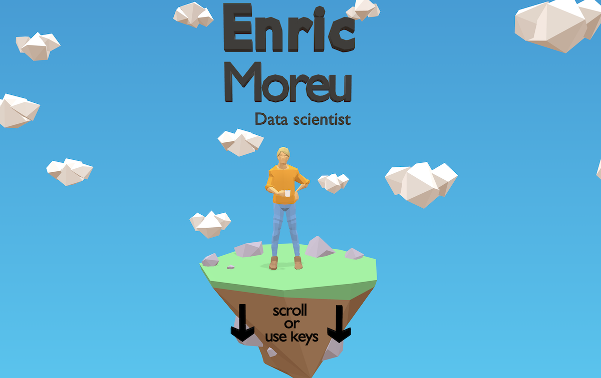

<div style="text-align: center;">
    
</div>

# How to create your own 3D resume

## Prerequisites

- Basic understanding of HTML, JavaScript, and CSS.
- Interest in learning 3D modeling.
- A GitHub account (for hosting your resume).

## Step 1: Setting up your environment

Download this repository, and open a terminal in this directory. Run the following command to start a simple HTTP server:

```bash
python3 -m http.server
```

Open your web browser and go to `localhost:8000` to see the website.

## Step 2: Learn some Blender basics
Your initial focus should be on learning some Blender. It will likely consume the bulk of your time but it's totally worth it. Here are some [video tutorials](https://www.youtube.com/watch?v=1jHUY3qoBu8).

### Tips:
- Spend some time watching Blender videos and practicing before trying to build your resume. Make sure you learn all the useful shortcuts and Blender operations.
- Sketch your design on paper, this will help you visualise the multiple scenes.
- Stick to a low-poly design where possible, as it's easier to manage and loads faster.
- Use a standard colour palette, like [this one](https://coolors.co/2176ae-57b8ff-b66d0d-fbb13c-fe6847).
- Use a rigged model like [this one](https://www.youtube.com/watch?v=mnP54h3x6_Y) to display your persona.
- Optionally, you can add simple animations to the 3D scene to make it more dynamic.

You can download Blender [here](https://www.blender.org/download/).

## Step 3: Create your 3D models
Each scene is composed of a 3D model. By default they are nested with a scale shift of 100.
Once you're satisfied with your 3D model, you can proceed to export it. Use the following settings:
- **Format**: GLTF
- **File Path**: `models/model.glb`

Important: add your model names in `modelNames`. They will be presented in this order.

After exporting, refresh `localhost:8000` to see your model. Before going to the next step, make sure that the website looks good in different viewports (smartphone, tablet, desktop)

## Step 4 (optional): Compress the 3D model to reduce loading time

In order to make the GLTF model lighter [install the Draco encoder](https://github.com/CesiumGS/gltf-pipeline) and run `compress_models.sh`.

## Step 5: Publish using GitHub Pages

Publish your resume online using GitHub Pages. It will be hosted for free and accessible via `https://your_username.github.io/resume`. Follow [these instructions](https://docs.github.com/en/pages/getting-started-with-github-pages/creating-a-github-pages-site) to get it set up.
